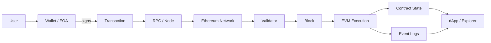

# Mermaid Diagram — Week 1 Ethereum Flow

```mermaid
flowchart LR
    U[User] --> W[Wallet / EOA]
    W -->|signs| T[Transaction]
    T --> R[RPC / Node]
    R --> N[Ethereum Network]
    N --> V[Validator]
    V --> B[Block]
    B --> E[EVM Execution]
    E --> S[Contract State]
    E --> L[Event Logs]
    S --> D[dApp / Explorer]
    L --> D
```
